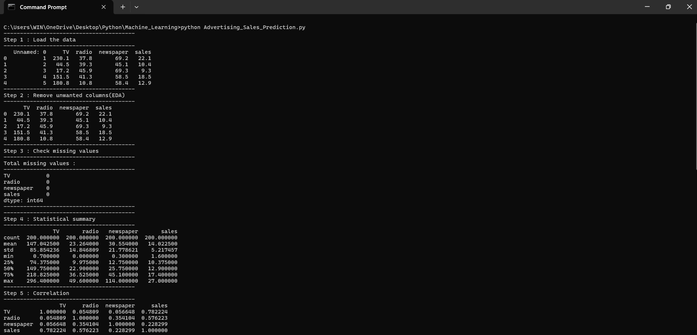
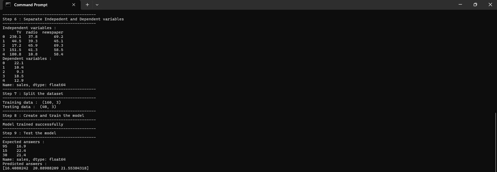
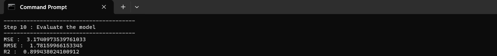
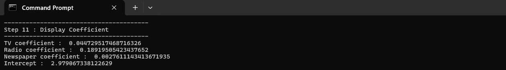

# Advertising Sales Prediction using Multiple Linear Regression

## 📌 Project Overview

This project demonstrates **Advertising Sales Prediction using Multiple Linear Regression** with Python and Machine Learning.

The model is trained using the **Advertising dataset** to predict `sales` based on advertising expenditure on:

* TV
* Radio
* Newspaper

The project also performs basic data analysis, checks missing values, calculates correlation, evaluates the regression model, and displays the coefficients and intercept.

---

## 🎯 Objective

The main objective of this project is to:

* Load and analyze the Advertising dataset.
* Remove unwanted columns.
* Check for missing values.
* Generate a statistical summary.
* Find correlation between variables.
* Separate independent and dependent variables.
* Split the dataset into training and testing data.
* Train a Multiple Linear Regression model.
* Predict sales using testing data.
* Evaluate the model using MSE, RMSE, and R².
* Display the coefficients and intercept of the model.

---

## 🛠️ Technologies Used

* **Python**
* **NumPy**
* **Pandas**
* **Matplotlib**
* **Scikit-learn**

---

## 📚 Libraries Used

```python
import numpy as np
import pandas as pd
import matplotlib.pyplot as plt

from sklearn.linear_model import LinearRegression
from sklearn.model_selection import train_test_split
from sklearn.metrics import mean_squared_error, r2_score
```

### Library Description

| Library      | Purpose                               |
| ------------ | ------------------------------------- |
| NumPy        | Numerical calculations                |
| Pandas       | Data loading and data manipulation    |
| Matplotlib   | Data visualization                    |
| Scikit-learn | Machine Learning and model evaluation |

---

## 📂 Dataset

The project uses the **Advertising.csv** dataset.

The dataset contains advertising expenditure for different media and the corresponding sales.

### Input Features

| Feature   | Description                          |
| --------- | ------------------------------------ |
| TV        | Advertising expenditure on TV        |
| radio     | Advertising expenditure on Radio     |
| newspaper | Advertising expenditure on Newspaper |

### Target Variable

| Variable | Description     |
| -------- | --------------- |
| sales    | Sales generated |

The regression model uses:

```text
X = TV, radio, newspaper
Y = sales
```

---

## 🔄 Project Workflow

### Step 1: Load the Data

The `Advertising.csv` file is loaded using Pandas.

```python
df = pd.read_csv(Datapath)
```

The first five records are displayed using `df.head()`.

### Step 2: Remove Unwanted Columns

If the dataset contains an `Unnamed: 0` column, it is removed.

### Step 3: Check Missing Values

The program checks for missing values using:

```python
df.isnull().sum()
```

### Step 4: Statistical Summary

The `describe()` function is used to display statistical information such as:

* Count
* Mean
* Standard deviation
* Minimum
* Maximum
* Quartiles

### Step 5: Correlation

The program calculates the correlation between the numerical variables using:

```python
df.corr()
```

### Step 6: Separate Independent and Dependent Variables

**Independent variables:**

```text
TV
radio
newspaper
```

**Dependent variable:**

```text
sales
```

### Step 7: Split the Dataset

The dataset is divided into:

* **80% Training Data**
* **20% Testing Data**

The split uses:

```python
test_size=0.2
random_state=42
```

### Step 8: Create and Train the Model

A Multiple Linear Regression model is created using:

```python
model = LinearRegression()
```

The model is trained using the training dataset.

### Step 9: Test the Model

The trained model predicts sales values using the testing dataset.

```python
y_Pred = model.predict(X_test)
```

The program displays the first three expected and predicted values.

### Step 10: Evaluate the Model

The model is evaluated using three metrics.

#### Mean Squared Error (MSE)

MSE measures the average squared difference between actual and predicted values.

#### Root Mean Squared Error (RMSE)

RMSE measures the prediction error in the same unit as the target variable.

#### R² Score

R² measures how well the independent variables explain the variation in the dependent variable.

### Step 11: Display Coefficients and Intercept

The program displays the coefficients for:

* TV
* Radio
* Newspaper

It also displays the model's intercept.

---

## 📊 Regression Equation

The Multiple Linear Regression model follows the equation:

```text
Sales = Intercept + (TV × TV Coefficient)
                 + (Radio × Radio Coefficient)
                 + (Newspaper × Newspaper Coefficient)
```

The coefficients represent the contribution of each advertising medium to the predicted sales while considering the other variables.

---

## 📈 Model Evaluation

The following performance metrics are displayed when the program is executed:

```text
MSE  : ...
RMSE : ...
R2   : ...
```

The actual values obtained from the program can be added here after execution.

---

## 📸 Screenshots

### 1. Dataset and Program Output – Part 1



### 2. Dataset and Program Output – Part 2



### 3. Model Evaluation



### 4. Coefficients and Intercept



---

## 📁 Project Structure

```text
Advertising-Sales-Prediction/
│
├── Advertising.csv
├── Advertising_Sales_Prediction.py
├── README.md
│
└── Screenshots/
    ├── 01_Dataset_and_Output1.png
    ├── 02_Dataset_and_Output2.png
    ├── 03_Model_Evaluation.png
    └── 04_Coefficients_and_Intercept.png
```


---

## ▶️ How to Run

### 1. Clone the Repository

```bash
git clone <your-repository-link>
```

### 2. Open the Project Folder

```bash
cd Advertising-Sales-Prediction
```

### 3. Install Required Libraries

```bash
pip install numpy pandas matplotlib scikit-learn
```

### 4. Run the Program

```bash
python Advertising_Sales_Prediction.py
```

---

## 💻 Sample Output

```text
----------------------------------------
Step 1 : Load the data
----------------------------------------

      TV  radio  newspaper  sales
0   ...
1   ...
2   ...
3   ...
4   ...

----------------------------------------
Step 8 : Create and train the model
----------------------------------------

Model trained successfully

----------------------------------------
Step 9 : Test the model
----------------------------------------

Expected answers :
...

Predicted answers :
...

----------------------------------------
Step 10 : Evaluate the model
----------------------------------------

MSE :  ...
RMSE : ...
R2 :  ...

----------------------------------------
Step 11 : Display Coefficient
----------------------------------------

TV coefficient : ...
Radio coefficient : ...
Newspaper coefficient : ...
Intercept : ...
```

---

## 🌟 Key Concepts Demonstrated

* Data Loading
* Exploratory Data Analysis
* Data Cleaning
* Missing Value Checking
* Statistical Analysis
* Correlation Analysis
* Feature Selection
* Train-Test Split
* Multiple Linear Regression
* Model Prediction
* Mean Squared Error
* Root Mean Squared Error
* R² Score
* Regression Coefficients
* Model Intercept

---

## 👩‍💻 Author

**Sharvari Bhosale**

---

## 📌 Conclusion

This project demonstrates how **Multiple Linear Regression** can be used to predict sales based on advertising expenditure across TV, radio, and newspaper.

It provides a complete Machine Learning workflow, starting from **loading and analyzing the dataset** and continuing through **data preparation, model training, prediction, and performance evaluation**.

