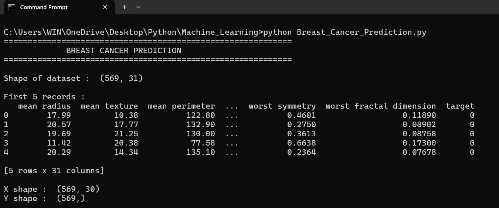
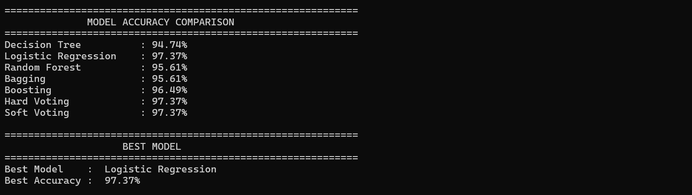
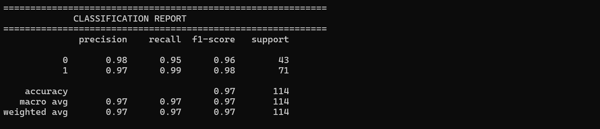
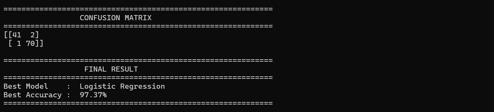
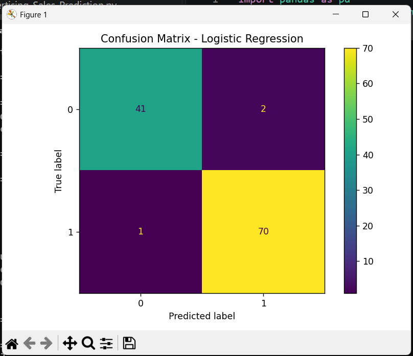
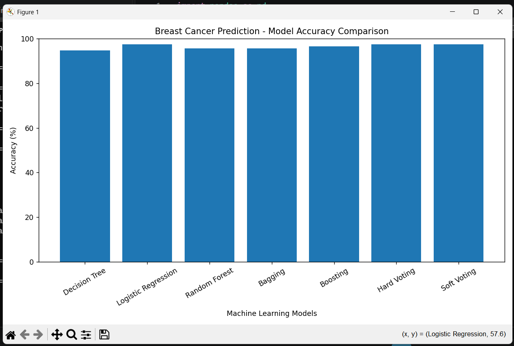

# Breast Cancer Prediction using Machine Learning

## 📌 Project Overview

This project implements a **Breast Cancer Prediction System** using multiple Machine Learning classification algorithms.

The main objective of this project is to train different classification models, compare their performance based on accuracy, identify the best-performing model, and evaluate the models using confusion matrices and classification reports.

The following Machine Learning models are used:

* Decision Tree Classifier
* Logistic Regression
* Random Forest Classifier
* Bagging Classifier
* AdaBoost Classifier
* Hard Voting Classifier
* Soft Voting Classifier

---

## 🎯 Objectives

* Load and analyze the breast cancer dataset.
* Separate input features and target labels.
* Split the dataset into training and testing data.
* Scale the input features using StandardScaler.
* Train multiple Machine Learning classification models.
* Calculate the accuracy of each model.
* Compare the performance of all models.
* Automatically identify the best-performing model.
* Generate classification reports.
* Generate confusion matrices.
* Visualize model accuracy using a bar graph.

---

## 🧠 Machine Learning Models

### 1. Decision Tree

Decision Tree is a supervised Machine Learning algorithm that makes predictions using a tree-like structure of decision rules.

### 2. Logistic Regression

Logistic Regression is a classification algorithm used for binary classification problems. It estimates the probability of a class and uses that probability to make predictions.

### 3. Random Forest

Random Forest combines multiple decision trees and uses their combined predictions to improve classification performance.

### 4. Bagging

Bagging trains multiple instances of a base Decision Tree model using different subsets of the training data and combines their predictions.

### 5. Boosting

AdaBoost is a boosting algorithm that combines multiple weak learners sequentially to create a stronger classifier.

### 6. Hard Voting

Hard Voting combines Logistic Regression, Decision Tree, and KNN classifiers. The class receiving the majority of votes is selected as the final prediction.

### 7. Soft Voting

Soft Voting combines the probability predictions of Logistic Regression, Decision Tree, and KNN classifiers and selects the class with the highest combined probability.

---

## 📂 Project Structure

```text
Breast-Cancer-Prediction/
│
├── Breast_Cancer_Prediction.py
├── breast_cancer.csv
├── README.md
│
└── Screenshots/
    ├── 01_Dataset_and_Output.png
    ├── 02_Model_Accuracy_Comparison.png
    ├── 03_Classification_Report.png
    ├── 04_Confusion_Matrix.png
    ├── 05_Logistic_Regression_Confusion_Matrix.png
    └── 06_Accuracy_Comparison_Graph.png
```

---

## 📊 Dataset

The project uses a CSV dataset named:

```text
breast_cancer.csv
```

The target column is:

```text
target
```

The remaining columns are used as input features for prediction.

---

## ⚙️ Technologies Used

* Python
* Pandas
* Scikit-learn
* Matplotlib

---

## 🔧 Python Libraries

```python
import pandas as pd
import matplotlib.pyplot as plt

from sklearn.model_selection import train_test_split
from sklearn.preprocessing import StandardScaler

from sklearn.linear_model import LogisticRegression
from sklearn.tree import DecisionTreeClassifier
from sklearn.neighbors import KNeighborsClassifier

from sklearn.ensemble import (
    RandomForestClassifier,
    BaggingClassifier,
    AdaBoostClassifier,
    VotingClassifier
)

from sklearn.metrics import (
    accuracy_score,
    classification_report,
    confusion_matrix,
    ConfusionMatrixDisplay
)
```

---

## 🚀 How to Run the Project

### Step 1: Clone the repository

Clone or download this project from GitHub.

### Step 2: Install required libraries

Open Command Prompt or Terminal and run:

```bash
pip install pandas matplotlib scikit-learn
```

### Step 3: Keep the dataset in the project folder

Make sure:

```text
breast_cancer.csv
```

is present in the same folder as the Python program.

### Step 4: Run the program

```bash
python Breast_Cancer_Prediction.py
```

---

## 📈 Model Comparison

The program calculates and compares the accuracy of seven model configurations:

```text
Decision Tree
Logistic Regression
Random Forest
Bagging
Boosting
Hard Voting
Soft Voting
```

The model with the highest accuracy is automatically selected as the **Best Model**.

Example:

```text
============================================================
              MODEL ACCURACY COMPARISON
============================================================

Decision Tree          : XX.XX%
Logistic Regression    : XX.XX%
Random Forest          : XX.XX%
Bagging                : XX.XX%
Boosting               : XX.XX%
Hard Voting            : XX.XX%
Soft Voting            : XX.XX%

============================================================
                    BEST MODEL
============================================================

Best Model    : XX.XX
Best Accuracy : XX.XX%
```

The actual accuracy values are generated when the program is executed.

---

## 📋 Model Evaluation

The trained models are evaluated using accuracy, classification reports, and confusion matrices.

### Classification Report

The classification report provides:

* Precision
* Recall
* F1-score
* Support

### Confusion Matrix

The confusion matrix shows the number of correctly and incorrectly classified samples for each class.

The project also generates a **Logistic Regression confusion matrix graph** for visual evaluation of its predictions.

### Best Model Evaluation

After comparing all model accuracies, the model with the highest accuracy is selected automatically.

Its classification report and confusion matrix are displayed for further evaluation.

---

## 📊 Accuracy Comparison Graph

A bar graph is generated to compare the accuracy of all seven Machine Learning models.

This provides a visual representation of the performance of each model and makes it easier to identify the best-performing model.

---

## 📸 Screenshots

### 1. Dataset and Program Output



### 2. Model Accuracy Comparison



### 3. Classification Report



### 4. Confusion Matrix



### 5. Logistic Regression Confusion Matrix



### 6. Accuracy Comparison Graph



---

## ✅ Result

The project successfully trains and evaluates multiple Machine Learning classification models for breast cancer prediction.

The accuracies of all seven models are compared automatically, and the model achieving the highest accuracy is selected as the **best-performing model**.

The models are further evaluated using classification reports and confusion matrices. The accuracy comparison graph provides a visual comparison of the performance of all models.

---

## 👩‍💻 Author

**Sharvari Bhosale**

### Machine Learning Project

**Breast Cancer Prediction using Multiple Classification Algorithms**

