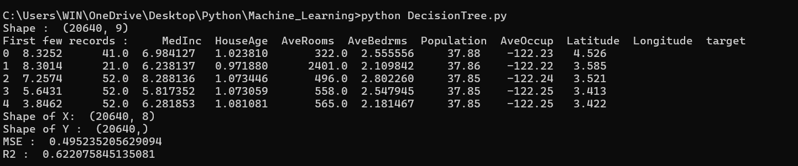
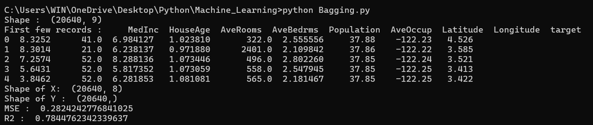
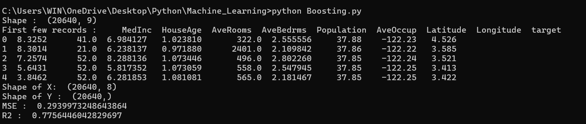

# California Housing Prediction

## 📌 Project Overview

This project implements three different Machine Learning regression algorithms to predict house values using the **California Housing Dataset**.

The following models are implemented:

* Decision Tree Regressor
* Bagging Regressor
* Gradient Boosting Regressor

The performance of each model is evaluated using **Mean Squared Error (MSE)** and **R² Score**.

---

## 🎯 Objective

The main objective of this project is to predict California housing prices based on different housing-related features using Machine Learning regression techniques.

This project also demonstrates the implementation of **Decision Tree, Bagging, and Boosting** algorithms for regression.

---

## 📂 Dataset

The project uses the `california_housing.csv` dataset.

The dataset contains housing-related information that is used to predict the target value.

### Input and Output

* **Input (`X`)** → All columns except `target`
* **Output (`Y`)** → `target`

The data is separated using:

```python
X = df.drop("target", axis=1)
Y = df["target"]
```

---

## 🤖 Machine Learning Models

### 1. Decision Tree Regressor

The Decision Tree Regressor creates a tree-like structure to learn relationships between input features and the target value.

```python
DecisionTreeRegressor(random_state=42)
```

---

### 2. Bagging Regressor

Bagging Regression uses multiple Decision Tree models and combines their predictions to improve the stability and performance of the model.

A Decision Tree is used as the base estimator.

```python
BaggingRegressor(
    estimator=base_model,
    n_estimators=10,
    random_state=42
)
```

---

### 3. Gradient Boosting Regressor

Gradient Boosting builds multiple decision trees sequentially. Each new tree attempts to improve the errors made by the previous trees.

```python
GradientBoostingRegressor(
    n_estimators=100,
    learning_rate=0.1,
    max_depth=3,
    random_state=42
)
```

---

## 🔄 Project Workflow

```text
Load Dataset
     ↓
Separate Input and Target Variables
     ↓
Split Dataset into Training and Testing Data
     ↓
     ├── Decision Tree Regressor
     │
     ├── Bagging Regressor
     │
     └── Gradient Boosting Regressor
              ↓
       Make Predictions
              ↓
       Evaluate the Models
              ↓
       Calculate MSE and R² Score
```

---

## 📊 Model Evaluation

The models are evaluated using the following metrics:

### Mean Squared Error (MSE)

MSE calculates the average squared difference between actual and predicted values.

**Lower MSE indicates better performance.**

### R² Score

R² Score measures how well the model explains the variation in the target variable.

**A value closer to 1 generally indicates better performance.**

---

## 🛠️ Technologies Used

* Python
* Pandas
* Scikit-learn
* Machine Learning
* Regression
* Decision Tree
* Bagging
* Gradient Boosting

---

## 📦 Libraries Used

```python
import pandas as pd

from sklearn.model_selection import train_test_split
from sklearn.tree import DecisionTreeRegressor
from sklearn.ensemble import BaggingRegressor
from sklearn.ensemble import GradientBoostingRegressor
from sklearn.metrics import mean_squared_error, r2_score
```

---

## 📁 Project Structure

```text
California-Housing-Prediction/
│
├── california_housing.csv
├── DecisionTree.py
├── Bagging.py
├── Boosting.py
├── README.md
│
└── Screenshots/
    ├── 01_DecisionTree.png
    ├── 02_Bagging.png
    └── 03_Boosting.png
```

---

## 📸 Screenshots

### Decision Tree Regression



### Bagging Regression



### Gradient Boosting Regression



---

## ▶️ How to Run

### 1. Clone the Repository

```bash
git clone <your-repository-url>
```

### 2. Open the Project Folder

```bash
cd California-Housing-Prediction
```

### 3. Install Required Libraries

```bash
pip install pandas scikit-learn
```

### 4. Run Decision Tree

```bash
python DecisionTree.py
```

### 5. Run Bagging

```bash
python Bagging.py
```

### 6. Run Gradient Boosting

```bash
python Boosting.py
```

---

## 📈 Output

Each program displays:

* Dataset shape
* First few records
* Shape of input features
* Shape of target variable
* Mean Squared Error (MSE)
* R² Score

The results can be used to understand the performance of each regression model.

---

## 👩‍💻 Author

**Sharvari Bhosale**


