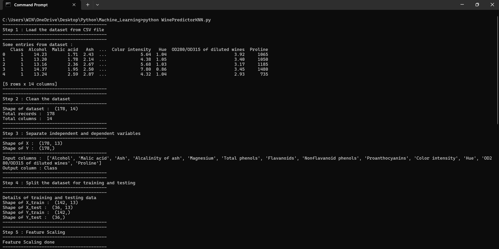
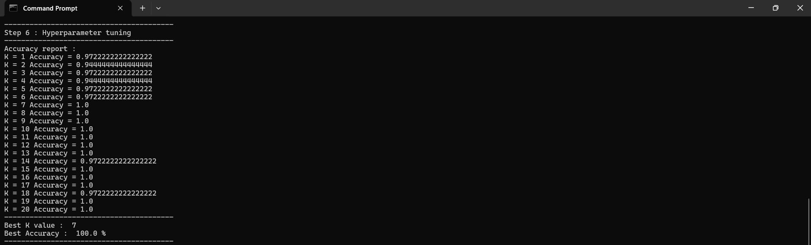
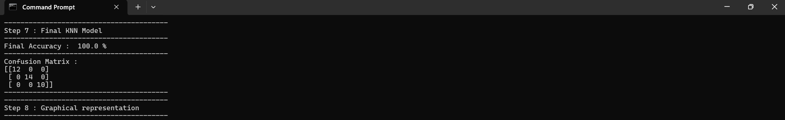
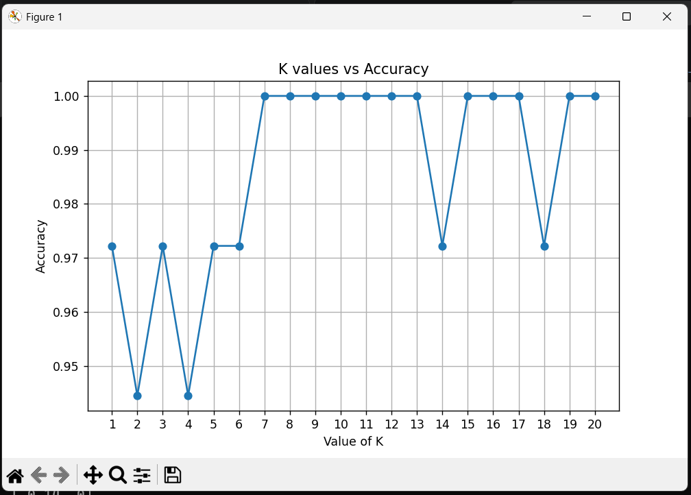

# KNN Wine Classifier

## 📌 Project Description

This project implements a **Wine Classification system using the K-Nearest Neighbors (KNN) Machine Learning algorithm**.

The program reads wine-related data from a CSV file, cleans the dataset, separates input and output variables, performs feature scaling, tests different values of K, identifies the best K value based on accuracy, and evaluates the final model using accuracy and a confusion matrix.

---

## 🎯 Objective

The main objective of this project is to:

* Understand the K-Nearest Neighbors (KNN) algorithm.
* Perform data preprocessing.
* Apply feature scaling using `StandardScaler`.
* Split the dataset into training and testing data.
* Test different K values.
* Find the best K value based on accuracy.
* Evaluate the final classification model.

---

## 🛠️ Technologies Used

* Python
* Pandas
* Matplotlib
* Scikit-learn
* K-Nearest Neighbors (KNN)
* StandardScaler
* Jupyter Notebook / VS Code

---

## 📂 Project Structure

```text
KNN-Wine-Classifier/
│
├── WinePredictor.py
├── WinePredictor.csv
├── README.md
│
└── Screenshots/
    ├── 01_Dataset_and_Program_Output.png
    ├── 02_Accuracy_Report_and_Best_K.png
    ├── 03_Confusion_Matrix_and_Final_Accuracy.png
    └── 04_Graphical_Representation.png
```

---

## 📊 Dataset

The project uses a CSV dataset named:

```text
WinePredictor.csv
```

The dataset contains multiple input features and a target column:

```text
Class
```

The `Class` column is used as the dependent/output variable.

All remaining columns are used as independent/input variables.

---

## 🔄 Project Workflow

### Step 1 : Load Dataset

The CSV dataset is loaded using Pandas.

```python
df = pd.read_csv(DataPath)
```

The first few records are displayed using `df.head()`.

---

### Step 2 : Clean Dataset

Missing values are removed from the dataset.

```python
df.dropna(inplace=True)
```

The program also displays:

* Dataset shape
* Total records
* Total columns

---

### Step 3 : Separate Input and Output

The input features are stored in `X`.

```python
X = df.drop(columns=['Class'])
```

The target variable is stored in `Y`.

```python
Y = df['Class']
```

---

### Step 4 : Train-Test Split

The dataset is divided into training and testing data.

```python
X_train, X_test, Y_train, Y_test = train_test_split(
    X,Y,test_size=0.2,random_state=42,stratify=Y
)
```

* 80% data → Training
* 20% data → Testing

---

### Step 5 : Feature Scaling

KNN is distance-based, so feature scaling is performed using `StandardScaler`.

```python
scaler = StandardScaler()

X_train_scaled = scaler.fit_transform(X_train)
X_test_scaled = scaler.transform(X_test)
```

This brings the features to a comparable scale.

---

### Step 6 : Hyperparameter Tuning

Different values of `K` are tested from **1 to 20**.

```python
K_values = range(1,21)
```

For every K value:

1. KNN model is created.
2. Model is trained.
3. Predictions are generated.
4. Accuracy is calculated.
5. Accuracy is stored.

---

### Step 7 : Find Best K

The K value producing the highest accuracy is selected.

```python
Best_accuracy = max(accuracy_scores)

Best_K = K_values[accuracy_scores.index(Best_accuracy)]
```

The best K and its corresponding accuracy are displayed.

---

### Step 8 : Final Model Evaluation

The final KNN model is trained using the best K value.

The model performance is evaluated using:

* Accuracy
* Confusion Matrix

```python
Final_accuracy = accuracy_score(Y_test,Y_pred)
```

```python
confusion_matrix(Y_test,Y_pred)
```

---

## 📈 Graphical Representation

The project generates a graph showing the relationship between:

* K Value
* Accuracy

```text
K Values vs Accuracy
```

This helps identify how the choice of K affects the performance of the KNN classifier.

---

## 📸 Screenshots

### Dataset and Program Output

This screenshot shows the dataset loading process, sample dataset entries, dataset shape, total records, total columns, input columns, output column, and training/testing data details.


### Accuracy Report and Best K Value

This screenshot shows the accuracy obtained for different K values from 1 to 20, along with the best K value and its corresponding accuracy.


### Confusion Matrix and Final Accuracy

This screenshot shows the final KNN model accuracy and the confusion matrix obtained using the best K value.



### Graphical Representation

This screenshot shows the graphical representation of K values versus accuracy.



---

## ▶️ How to Run

### 1. Clone the repository

```bash
git clone <your-repository-url>
```

### 2. Open the project directory

```bash
cd KNN-Wine-Classifier
```

### 3. Install required libraries

```bash
pip install pandas matplotlib scikit-learn
```

### 4. Run the Python program

```bash
python WinePredictor.py
```

---

## 📌 Key Concepts

* Data Preprocessing
* Missing Value Handling
* Independent and Dependent Variables
* Train-Test Split
* Feature Scaling
* K-Nearest Neighbors
* Hyperparameter Tuning
* Model Evaluation
* Accuracy
* Confusion Matrix
* Data Visualization

---

## ✅ Conclusion

This project demonstrates how the **K-Nearest Neighbors (KNN)** algorithm can be used for wine classification.

It also demonstrates the importance of **feature scaling** and selecting an appropriate **K value** to improve the performance of a KNN classification model.

