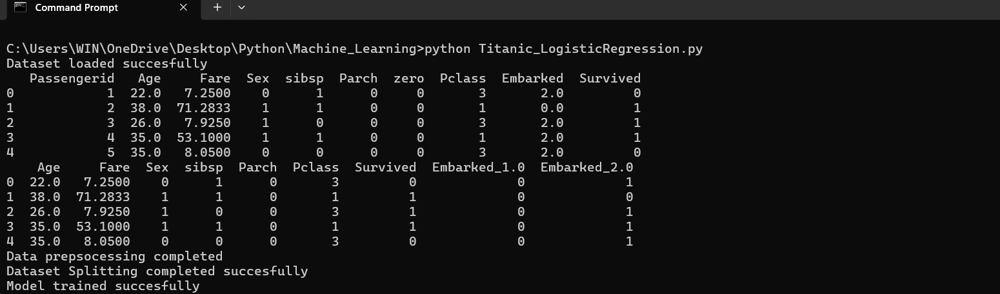
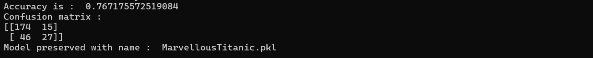
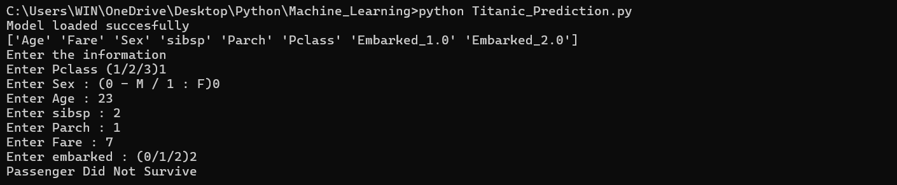

# Titanic Survival Prediction using Logistic Regression

## 📌 Project Overview

This project uses **Machine Learning and Logistic Regression** to predict whether a Titanic passenger survived or did not survive.

The project contains two Python programs:

* `Titanic_LogisticRegression.py` — Loads the dataset, preprocesses the data, trains and evaluates the Logistic Regression model, and saves the trained model.
* `Titanic_Prediction.py` — Loads the saved model and predicts the survival of a new passenger based on user-provided information.

---

## 🎯 Objectives

* Load the Titanic dataset using Pandas.
* Perform data preprocessing.
* Handle missing values.
* Remove unnecessary columns.
* Convert categorical data into numerical data.
* Split the dataset into training and testing data.
* Train a Logistic Regression model.
* Evaluate the model using accuracy and confusion matrix.
* Preserve the trained model using Joblib.
* Load the saved model.
* Predict the survival of a new passenger.

---

## 🛠️ Technologies Used

* Python
* Pandas
* NumPy
* Scikit-learn
* Joblib

---

## 📂 Project Structure

```text
Titanic-Survival-Prediction/
│
├── MarvellousTitanicDataset.csv
├── Titanic_LogisticRegression.py
├── Titanic_Prediction.py
├── MarvellousTitanic.pkl
├── README.md
│
└── Screenshots/
    ├── 01_Dataset_and_Output.png
    ├── 02_Accuracy_and_Confusion_Matrix.png
    └── 03_Survival_Prediction.png
```

> `MarvellousTitanic.pkl` is generated after running the training program. It contains the trained Logistic Regression model.

---

## 🔄 Project Workflow

```text
Titanic Dataset
       ↓
Load Dataset
       ↓
Data Preprocessing
       ↓
Handle Missing Values
       ↓
Convert Categorical Data
       ↓
Train-Test Split
       ↓
Train Logistic Regression Model
       ↓
Evaluate Model
       ↓
Save Trained Model
       ↓
Load Saved Model
       ↓
Enter New Passenger Information
       ↓
Predict Passenger Survival
```

---

## 📊 Data Preprocessing

The preprocessing function performs the following operations:

### Remove Unnecessary Columns

The following columns are removed:

```text
Passengerid
zero
name
```

### Handle Missing Values

Missing values are handled for:

* `Age` — Median value
* `Fare` — Median value
* `Embarked` — Most frequent value

### Convert Categorical Data

The `Embarked` column is converted into numerical dummy variables using Pandas:

```python
pd.get_dummies()
```

---

## 🤖 Model Training

The project uses the **Logistic Regression** algorithm:

```python
LogisticRegression(max_iter=1000)
```

The dataset is divided into:

* **80% Training Data**
* **20% Testing Data**

using:

```python
train_test_split(
    X,
    Y,
    test_size=0.2,
    random_state=42
)
```

---

## 📈 Model Evaluation

The trained model is evaluated using two metrics.

### Accuracy

```python
accuracy_score(Y_test, Y_pred)
```

Accuracy represents the percentage of correctly classified passengers.

### Confusion Matrix

```python
confusion_matrix(Y_test, Y_pred)
```

The confusion matrix shows the correct and incorrect predictions for:

* `0` — Passenger did not survive
* `1` — Passenger survived

---

## 💾 Model Preservation

After training and evaluation, the model is saved using Joblib:

```python
joblib.dump(model, "MarvellousTitanic.pkl")
```

The saved model can then be loaded by the prediction program without training the model again.

---

## 🔮 Passenger Survival Prediction

The `Titanic_Prediction.py` program loads the saved model:

```python
model = joblib.load("MarvellousTitanic.pkl")
```

The user enters the following passenger information:

* Pclass
* Sex
* Age
* SibSp
* Parch
* Fare
* Embarked

The program creates a DataFrame containing the passenger information and uses the trained Logistic Regression model to make a prediction.

### Prediction Classes

```text
0 → Passenger Did Not Survive
1 → Passenger Survived
```

---

## ▶️ How to Run the Project

### Step 1: Install Required Libraries

Open Command Prompt or Terminal and run:

```bash
pip install pandas numpy scikit-learn joblib
```

### Step 2: Run the Training Program

```bash
python Titanic_LogisticRegression.py
```

The program will:

1. Load the dataset.
2. Preprocess the data.
3. Split the dataset.
4. Train the Logistic Regression model.
5. Evaluate the model.
6. Save the trained model as `MarvellousTitanic.pkl`.

### Step 3: Run the Prediction Program

```bash
python Titanic_Prediction.py
```

Enter the passenger information when prompted.

---

## 🧪 Example Prediction

```text
Model loaded succesfully

['Pclass' 'Sex' 'Age' 'sibsp' 'Parch' 'Fare'
 'Embarked_1.0' 'Embarked_2.0']

Enter the information

Enter Pclass (1/2/3): 1
Enter Sex : (0 - M / 1 : F): 1
Enter Age : 25
Enter sibsp : 0
Enter Parch : 0
Enter Fare : 80
Enter embarked : (0/1/2): 1

[1]
```

Here:

```text
1 → Passenger Survived
0 → Passenger Did Not Survive
```

---

## 📸 Screenshots

### 1. Dataset and Program Output



### 2. Accuracy and Confusion Matrix



### 3. Passenger Survival Prediction




---

## 📚 Key Learning Outcomes

This project demonstrates practical knowledge of:

* Pandas DataFrame
* Data preprocessing
* Missing-value handling
* Categorical data encoding
* Feature and target separation
* Train-test splitting
* Logistic Regression
* Model prediction
* Accuracy calculation
* Confusion Matrix
* Joblib model preservation
* Loading a saved Machine Learning model
* Prediction on new data

---

## 👨‍💻 Author

**Sharvari Bhosale**

---

## ⭐ Conclusion

The Titanic Survival Prediction project demonstrates a complete Machine Learning workflow, starting from **dataset loading and preprocessing**, followed by **model training and evaluation**, and finally **saving the trained model and predicting the survival of a new passenger**.

